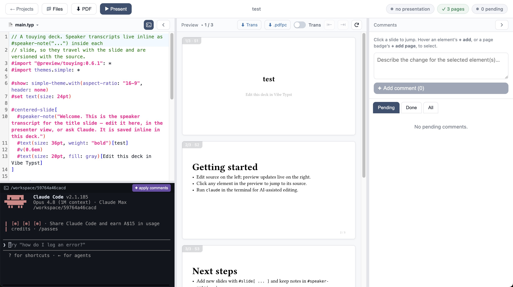
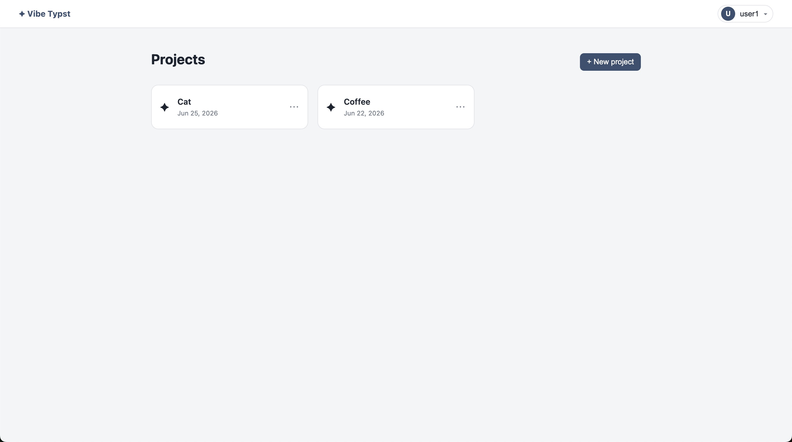
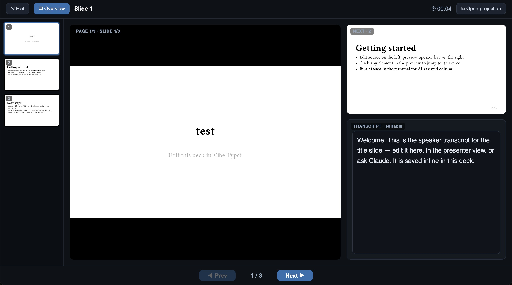
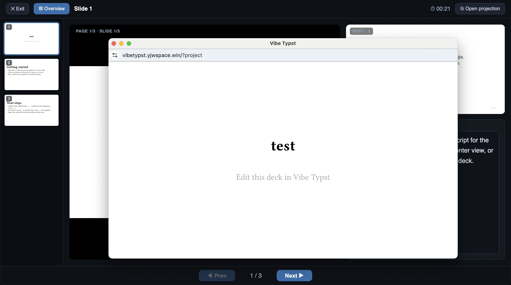

# Vibe Typst

**Click any element on a rendered slide. Anchor a comment to it. Claude finds the exact source and edits it — live, in the same file you're looking at.**

That's the core loop. Instead of describing to Claude "change the title on slide 3," you click the title directly. A chip appears confirming the selection, you describe what you want, and Claude edits the precise spot — no guessing, no line numbers. The change streams into your editor in real time.

And it goes both ways: if Claude's edit isn't quite right, just fix it yourself in the editor. You and Claude are writing to the same live document — there's no separate "AI output" to review and paste back. You keep typing while Claude is writing; Claude can continue from wherever you left off.

---

<table>
<tr>
<td width="50%">

**Editor** — source, preview, comments side by side



</td>
<td width="50%">

**Projects** — create and manage your decks



</td>
</tr>
<tr>
<td width="50%">

**Presenter view** — current slide, next slide, speaker notes



</td>
<td width="50%">

**Projection** — audience screen, synced automatically



</td>
</tr>
</table>

---

<video src="https://github.com/user-attachments/assets/cf5bbf63-17d0-4c91-8660-ad3392542e1d" controls width="100%"></video>

---

## How it works

### Editing with Claude

1. **Select** — hover any element on a rendered slide and click **＋** to anchor it. Build up as many anchors as you like across multiple slides. You can also anchor an entire page, or select text directly in the source editor.
2. **Comment** — describe the change you want and click **Add comment**.
3. **Apply** — hit **Apply comments**. Claude reads all pending comments with their source context, edits each one in place, and marks them done.

The edits appear in your editor live as Claude writes them. Not happy with a change? Edit it directly in the source — your change and Claude's are both going into the same document, so you can freely mix manual edits with AI-generated ones at any point. Comments survive any restructuring — they're anchored to content, not line numbers.

A `.mcp.json` is generated automatically when you open a project. To drive Claude yourself, just open a terminal in the project directory and run `claude`.

---

### Presenting

Click **Present** to open the presenter console. Click **Open projection** to open the audience screen in a second window — it follows your page automatically.

- **Presenter console** — slide strip, current slide, next-slide preview, speaker notes, timer
- **Projection screen** — full-screen slide, no chrome, live sync
- **Pin / Jump** buttons let you sync the editor preview to the projector and vice versa

Speaker notes live inline in the source as `#speaker-note["…"]`, so Claude can draft or rewrite them the same way it edits slides.

---

## Other features

- **Projects** — create, rename, duplicate, delete; per-project git versioning (save and restore named versions)
- **File manager** — multi-select, rename, duplicate, delete files; supports images and data files alongside `.typ`
- **Comment history** — each comment has a full append-only log; Pending / Done / All views
- **User accounts** (server mode) — invite-only admin panel, lock/force-offline controls, per-user isolated workspace, idle auto-stop

---

## Quick start

```bash
# Prerequisites: typst, node, uv, rust
brew install typst node uv
curl https://sh.rustup.rs -sSf | sh

# Build
cd resolver && cargo build --release && cd ..
cd backend && uv sync && cd ..
cd frontend && npm install && npm run build && cd ..

# Run
cd backend && uv run uvicorn app:app --port 8787
```

Open http://localhost:8787.

See [docs/deployment.md](docs/deployment.md) for full setup including LaunchAgent (background service) and server deployment.

---

## License

MIT — see [LICENSE](LICENSE).
