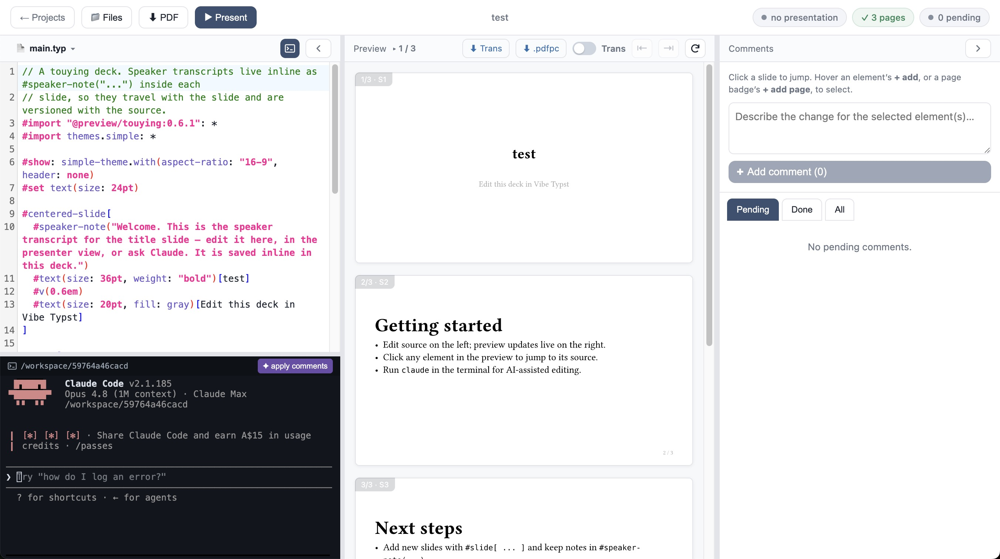
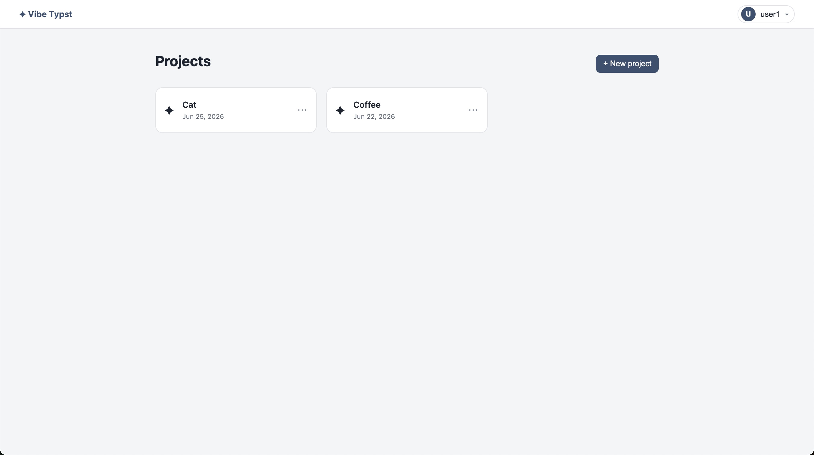
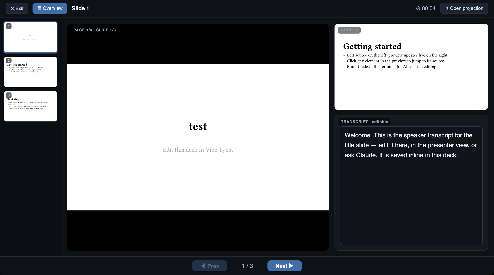
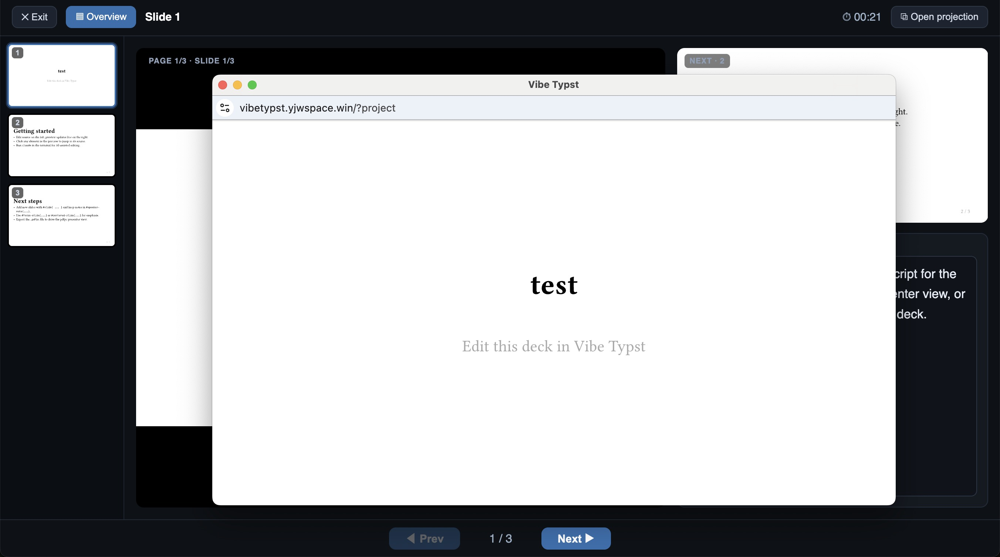

# Vibe Typst

**Click any element on a rendered slide. Anchor a comment to it. Claude finds the exact source and edits it — live, in the same file you're looking at.**

That's the core loop. Instead of describing to Claude "change the title on slide 3," you click the title directly. A chip appears confirming the selection, you describe what you want, and Claude edits the precise spot — no guessing, no line numbers. The change streams into your editor in real time.

And it goes both ways: if Claude's edit isn't quite right, just fix it yourself in the editor. You and Claude are writing to the same live document — there's no separate "AI output" to review and paste back. You keep typing while Claude is writing; Claude can continue from wherever you left off.

---

<table>
<tr>
<td width="50%">

**Editor** — source, preview, comments side by side



</td>
<td width="50%">

**Projects** — create and manage your decks



</td>
</tr>
<tr>
<td width="50%">

**Presenter view** — current slide, next slide, speaker notes



</td>
<td width="50%">

**Projection** — audience screen, synced automatically



</td>
</tr>
</table>

---

<video src="https://github.com/user-attachments/assets/cf5bbf63-17d0-4c91-8660-ad3392542e1d" controls width="100%"></video>

---

## How it works

### Editing with Claude

1. **Select** — hover any element on a rendered slide and click **＋** to anchor it. Build up as many anchors as you like across multiple slides. You can also anchor an entire page, or select text directly in the source editor.
2. **Comment** — describe the change you want and click **Add comment**.
3. **Apply** — hit **Apply comments**. Claude reads all pending comments with their source context, edits each one in place, and marks them done.

The edits appear in your editor live as Claude writes them. Not happy with a change? Edit it directly in the source — your change and Claude's are both going into the same document, so you can freely mix manual edits with AI-generated ones at any point. Comments survive any restructuring — they're anchored to content, not line numbers.

A `.mcp.json` is generated automatically when you open a project. To drive Claude yourself, just open a terminal in the project directory and run `claude`.

---

### Connecting a remote AI agent

In server mode, Vibe Typst also exposes an authenticated project-level MCP at
`https://<your-host>/mcp`. This lets an AI agent running on another machine create or open a
project, update slides and files, read rendered pages, and share a normal browser link with a
human. PDF projects support embedded-text reading, rendered page previews, per-page transcripts,
and versioned PDF replacement; comments remain a Typst-only workflow.

1. Sign in, open the account menu, and choose **Personal access tokens**.
2. Create an **Editor** token and copy the secret when it is shown. It cannot be displayed again.
3. Configure the remote MCP URL and keep the secret in the client’s secret store.
4. Call `list_projects` or create a project, then call `open_project`.
5. Keep the returned `project_handle` for project-scoped calls.
6. Give the returned `web_url` to the human. They sign in through the normal web login; the URL
   contains neither the token nor the project handle.
7. Revoke the token from the account menu when it is no longer needed.

Generic Streamable HTTP client configuration:

```json
{
  "type": "streamable-http",
  "url": "https://slides.example.com/mcp",
  "headers": {
    "Authorization": "Bearer ${VIBE_TYPST_TOKEN}"
  }
}
```

```bash
export VIBE_TYPST_TOKEN="vbt_..."
```

Environment-variable expansion differs between MCP clients. Do not paste a token into source
control, a project URL, or ordinary client logs.

For a ready-to-give agent contract that covers MCP setup, reusable skill creation, the mandatory
Touying workflow, and the single-file `main.typ` rule, see the
[Remote MCP agent setup and operating guide](docs/remote-mcp-agent-guide.md).

---

### Presenting

Click **Present** to open the presenter console. Click **Open projection** to open the audience screen in a second window — it follows your page automatically.

Hold the left mouse button on the current slide to show the laser pointer; releasing
it hides the dot on both the projection and recorded video. Choose **Hide preview**
on the next-slide window to give the full right column to your transcript, and
**Show preview** to restore it. Use **A− / A+** in the transcript header to adjust
its font size (12–36 px). Preview visibility and font size are remembered in this browser.

- **Presenter console** — slide strip, current slide, next-slide preview, speaker notes, timer
- **Projection screen** — full-screen slide, no chrome, live sync
- **Pin / Jump** buttons let you sync the editor preview to the projector and vice versa

Speaker notes live inline in the source as `#speaker-note["…"]`, so Claude can draft or rewrite them the same way it edits slides.

### Recording a presentation

In **Present**, choose **Record presentation**. On each page, click **Start page**,
narrate and hold the left mouse button when pointing, then **Stop & save page** before
navigating. **Preview page** plays that page's take; **Re-record page** replaces only
that page after the new take saves successfully. Recorded pages show a REC badge.
Both Typst and PDF presentations support this workflow.
Presenter actions use compact icon buttons; hover for function details. Recording
actions, duration counters and pacing controls share one toolbar row.
While recording, the right end of the toolbar shows live microphone input in
dBFS and a volume meter. Green/yellow/red segments reflect the current level;
the meter disappears when recording stops. It does not play microphone audio
through the speakers or measure physical sound pressure.
New recordings use the projection laser's red core, white ring, glow and shadow,
scaled for the 1080p frame. Existing takes retain their recorded pixels; re-record
a page to apply the new laser appearance.
With FFmpeg installed, previews cache a stream-copied container with complete
duration and seek indexes, including for older takes. Native video controls use a
fixed full timeline and show buffering separately; original media stays intact.

With at least one page recorded, **Export full MP4** assembles the current takes in
page order. If some pages have no recording, an in-app dialog lists them before
you continue; those pages are skipped. The export dialog also lets you choose
optional noise reduction and voice processing. When export finishes, use **Download MP4**. The video contains the slide,
mouse pointer, and microphone audio at 1920x1080 / 30 fps with H.264/AAC; presenter
controls and speaker notes stay outside the video. Changed slide content requires
re-recording the affected pages before export.

Export applies gentle [background noise reduction](https://www.ffmpeg.org/ffmpeg-filters.html#afftdn)
before automatically balancing loudness between page recordings using
[FFmpeg loudness normalization](https://www.ffmpeg.org/ffmpeg-filters.html#loudnorm)
(target -16 LUFS with true-peak headroom), so page transitions have more consistent volume. It
preserves natural speech dynamics where possible; silent or unmeasurably short
takes are not boosted. Original recordings and single-page previews are preserved.

Optional [audio models](docs/audio-models.md) add DPDFNet8 48 kHz noise reduction and
Seed-VC voice-tone conversion using one recorded page or an uploaded reference.
Voice conversion runs after model noise reduction and before loudness balancing.
Model dependencies and weights are installed separately; the standard app and
original-voice export work without them. The dialog shows available models.

Use **Clear page recording** to remove just the current take. The toolbar shows
current-page and total recording time; a live retake replaces the old page in the
running total. Set **Talk target** in minutes for per-page pacing suggestions,
allocated by transcript length (CJK characters and alphabetic words). This is a
reference budget, rather than a prediction of reading speed.

Typst recording mode adds a stable `// vibe-typst-recording: <uuid>` reference on
each explicit Touying slide opener in the source. Keep it with that slide when
moving or copying source: reordered slides retain their corresponding recording,
and deleting a slide removes its association from the current deck. Overlays are
distinguished within each logical slide. Changed rendered content remains marked
for rerecording. Old recordings migrate only when content hashes uniquely match;
unmatched media is preserved. PDF recordings retain their page/content checks.

Use HTTPS or localhost and allow microphone access. Export needs `ffmpeg` and
`ffprobe` on the backend (`brew install ffmpeg` for local macOS); both workspace
Containerfiles include these tools.

Per-page takes and pointer timestamps persist beneath
the project's `.tcb/recordings/`, outside slide Git versions. Refreshing retains
saved takes. A failed upload offers retry and a local take backup; keep the tab open
until it saves. Hiding the tab stops the current recording to avoid missing frames.
Export runs in the background; a server restart requires starting the export again.

Recording smoke tests use disposable projects and Chromium's simulated microphone:

```bash
cd frontend
npm run build
npm run test:recording-e2e
```

---

## Other features

- **Projects** — create immutable Typst or single-PDF project types, rename, duplicate every current project file into a fresh version history, delete; per-project git versioning
- **File manager** — multi-select, rename, duplicate, delete files; supports images and data files alongside `.typ`
- **Comment history** — each comment has a full append-only log; Pending / Done / All views
- **User accounts** (server mode) — invite-only admin panel, personal Viewer/Editor tokens, lock/force-offline controls, per-user isolated workspace, idle auto-stop

---

## Quick start

```bash
# Prerequisites: typst, node, uv, rust
brew install typst node uv
curl https://sh.rustup.rs -sSf | sh

# Build
cd resolver && cargo build --release && cd ..
cd backend && uv sync && cd ..
cd frontend && npm install && npm run build && cd ..

# Run
cd backend && uv run uvicorn app:app --port 8787
```

Open http://localhost:8787.

See [docs/deployment.md](docs/deployment.md) for full setup including LaunchAgent (background service) and server deployment.

---

## License

MIT — see [LICENSE](LICENSE).
